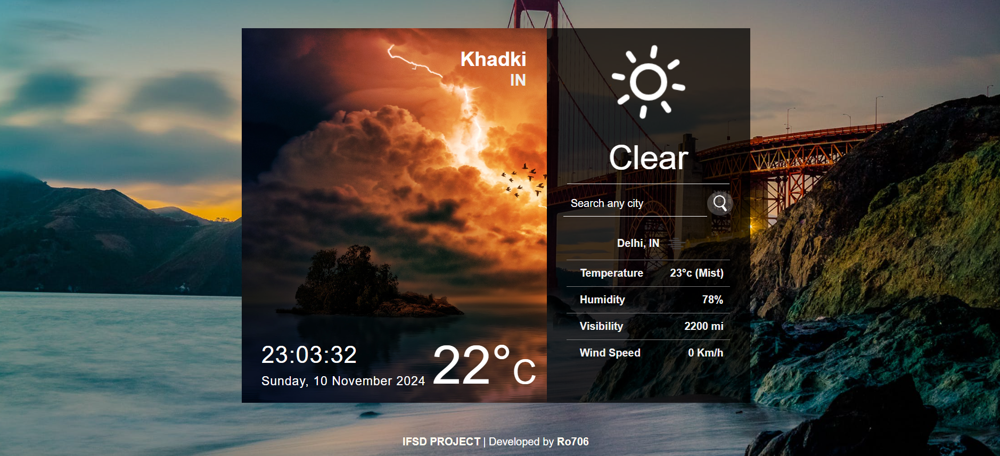

# 🌦️ Weather App

## Welcome to the **Weather App**! This is a dynamic and user-friendly web application built using **React.js** to provide real-time weather data for cities across the globe. The app features a 5-day weather forecast, displaying key weather conditions such as temperature, humidity, wind speed, and a weather description. It also includes dynamic background images that change according to the current weather. 🌍

## 🌟 Key Features

- **React.js Powered** ⚛️: The app leverages the power of React.js to create a seamless and fast user experience.
- **OpenWeatherMap API** 🌐: Retrieves current and 5-day weather forecasts from the OpenWeatherMap API.
- **City Search** 🔎: Users can search for a city by name to get up-to-date weather conditions.
- **Weather Conditions** ☁️: Displays vital weather metrics like temperature, humidity, wind speed, and more.
- **Dynamic Background Images** 🌄: The app's background changes according to the current weather for an immersive feel.
- **Responsive Design** 📱: Fully responsive across different devices for a smooth experience everywhere.

---

## 🛠️ Skills & Technologies Used

- **HTML5** 🖼️
- **CSS3** 🎨
- **JavaScript** 📝
- **React.js** ⚛️
- **Postman** 📬 (for API testing)
- **REST APIs** 🔌

---

## 🚀 Future Improvements

- Implement **unit tests** to ensure code reliability.
- Add **dark mode** for better usability in low light.
- Include **user location** functionality for automatic weather updates.
- Improve **data visualization** for better understanding of weather trends.

---


### Screenshot


### Example
In the screenshot above:
- The app shows the weather for "Khadki, IN."
- The weather condition is "Clear," with a temperature of 22°C.
- Additional data includes:
  - Temperature in Delhi, IN: 23°C (Mist)
  - Humidity: 78%
  - Visibility: 2200 meters
  - Wind Speed: 0 Km/h

### Technologies Used
- **React.js**: For building the user interface.
- **OpenWeather API**: For fetching real-time weather data.
- **CSS & Bootstrap**: For styling and responsive layout

### api key
```js
module.exports = {
  key: "{Your API key}",
  base: "https://api.openweathermap.org/data/2.5/",
};
```

## DEMO-https:https://aadityaweatherapp.netlify.app/

